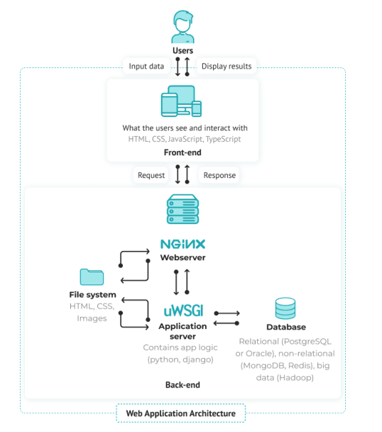

# Web 代理

代理的含义是代理xxx去做某一件事

## 正向代理

> 正向代理是以服务器为中心，**代理（处理的）对象是客户端**

正向代理的过程，它隐藏了真实的请求客户端，服务端不知道真实的客户端是谁，客户端请求的服务都被[代理服务器](https://www.zhihu.com/search?q=代理服务器&search_source=Entity&hybrid_search_source=Entity&hybrid_search_extra={"sourceType"%3A"answer"%2C"sourceId"%3A128105528})代替来请求。

某些科学上网工具扮演的就是典型的正向代理角色。用浏览器访问 [http://www.google.com](https://link.zhihu.com/?target=http%3A//www.google.com/) 时，被残忍的block，于是你可以在国外搭建一台代理服务器，让代理帮我去请求google.com，代理把请求返回的相应结构再返回给我。


## 反向代理（分发代理）

> 反向代理是以客户端为中心，**代理（处理的）对象是服务端**

反向代理隐藏了真实的服务端。

当我们请求 [w](https://link.zhihu.com/?target=http%3A//www.baidu.com/)ww.baidu.com 的时候，就像拨打10086一样，背后可能有成千上万台服务器为我们服务，但具体是哪一台，你不知道，也不需要知道，你只需要知道[反向代理服务器](https://www.zhihu.com/search?q=反向代理服务器&search_source=Entity&hybrid_search_source=Entity&hybrid_search_extra={"sourceType"%3A"answer"%2C"sourceId"%3A128105528})是谁就好了，[w](https://link.zhihu.com/?target=http%3A//www.baidu.com/)ww.baidu.com 就是我们的反向代理服务器，反向代理服务器会帮我们把请求转发到真实的服务器那里去。

Nginx就是性能非常好的反向代理服务器，用来做负载均衡。


# 图解代理

## 网络访问

通常情况下，作为客户端(Client)，访问网络上的资源，都是发送请求到互联网(Internet)，之后导向相应的服务端(Server)获取资源。


## 正向代理(Proxy)

正向代理(Proxy)，就是指在Client和Internet之间加一个中间服务，这个服务作为Client的代理人，拦截所有Client发出去的通讯，以代理人的身份再统一发出，从而代表Client和Internet进行交流，避免Client和Internet的直接交流。

加上一个正向代理(Proxy)的好处：

- Proxy可以隐藏Client的IP, 暴露出去只是Proxy自己的IP，从而保护Client的隐私安全。
- Proxy可以作为缓存，当有相同资源的请求时，可以直接返回缓存内容，提高响应速度。
- Proxy可以作为过滤，限制或者阻断访问Internet上面一些特定内容。
- Proxy可以作为跳板(比如VPN)，访问一些被防火墙或者网络区域限制的内容。


## 反向代理

反向代理(Reverse Proxy), 就是指在Internet和Web Server之间加上一个中间服务，这个服务作为Web Server的代理人，拦截所有发给Web Server的请求，然后再统一分发给代理的Web Servers, 避免Internet网络流量直接发给Web Server. 

这样加上一个反向代理(Reverse Proxy)有什么好处呢？

- ReverseProxy可以隐藏WebServerIP, 只有反向代理的IP暴露网络, 从而保护WebServer。
- ReverseProxy可以作为LoadBalancer，合理分配流量到集群里的WebServer。
- ReverseProxy可以作为网站静态内容的缓存，大大提高响应速度并减轻WebServer负担。
- ReverseProxy可以代为处理SSL加密(计算量较大)，减轻WebServer的负担。


# 反向代理工程经验

## GlobalServerLoadBalancer

- ReverseProxy还有一个比较有意思的功能就是可以作为GlobalServerLoadBalancer
-  GlobalServerLoadBalancer的作用更多是让不同地域的人访问网站会更快
- 大型网站(比如Netflix, Google, Amazon etc)，会在全世界各个地方部署ReverseProxy，然后把相应区域的流量导到地理位置更近的Web Server，从而提供更快速的响应服务。


## 网络架构

在网络架构的工程实践上，如果一个私有网络想要访问其他网络的资源，那么一般需要给私有网络加上一个正向代理(Proxy)。如果一个私有网络想要被其他网络访问，那么一般需要给私有网络加上一个反向代理(Reverse Proxy)，或者API Gateway(本身也可以算作一种Reverse Proxy)。

# NGINX 

[NGINX](https://nginx.org/) 是一种高性能网络服务器，旨在满足现代网络日益增长的需求。它专注于高性能、高并发和低资源使用。尽管它通常被称为 Web 服务器，但 NGINX 的核心是一个[反向代理](https://en.wikipedia.org/wiki/Reverse_proxy) 服务器。

## Ubuntu安装

执行以下命令安装 NGINX：

```shell
sudo apt install nginx -y
```

安装完成后，NGINX 应自动注册为 `systemd` 服务并运行。要检查，请执行以下命令：

```shell
sudo systemctl status nginx

# ● nginx.service - A high performance web server and a reverse proxy server
#      Loaded: loaded (/lib/systemd/system/nginx.service; enabled; vendor preset: enabled)
#      Active: active (running)
```

如果状态显示 `running`，那么就可以开始了。否则，可以通过执行以下命令来启动服务：

```shell
sudo systemctl start nginx
```

最后，为了直观地验证一切是否正常，可使用喜欢的浏览器访问服务器/虚拟机，应该会看到 NGINX 的默认欢迎页面。

NGINX 通常安装在 `/etc/nginx` 目录中，我们接下来的大部分工作都将在这里完成。

[Nginx 入门指南](https://juejin.cn/post/6844904129987526663)


## 拓展阅读

[Apache vs Nginx: Practical Considerations](https://www.digitalocean.com/community/tutorials/apache-vs-nginx-practical-considerations)

# 资源链接与拓展阅读

【1】[反向代理为何叫反向代理？ - 知乎](https://www.zhihu.com/question/24723688)

【2】[反向代理为何叫反向代理？ - Mingqi的回答 - 知乎](https://www.zhihu.com/question/24723688/answer/2771833737) 

【3】[NGINX完全手册](https://www.freecodecamp.org/chinese/news/the-nginx-handbook/)

